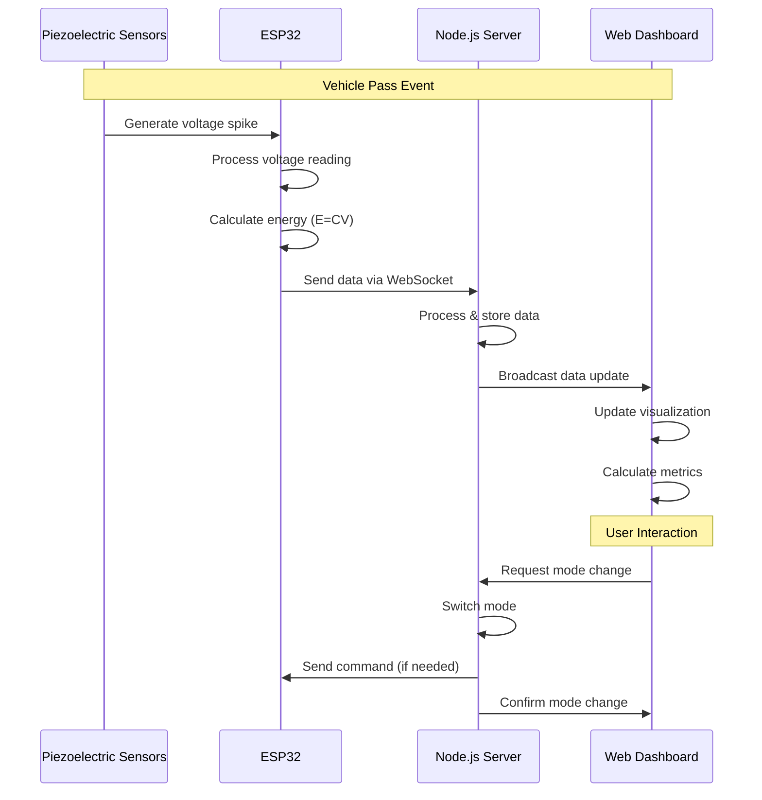

# Piezoelectric Road Power Simulator with ESP32 + Node.js

A full-stack energy harvesting system that captures mechanical energy from road vibrations using piezoelectric elements, stores the collected energy in capacitors, and uses it to power LED lighting. This project combines hardware components with real-time data visualization to provide insights into renewable energy generation from roadway vibrations.


## 📋 Overview

The Piezoelectric Road Power Simulator demonstrates a complete renewable energy cycle:

1. **Energy Harvesting**: Piezoelectric transducers convert mechanical pressure from vehicle passes into electrical energy
2. **Energy Storage**: Harvested energy is stored in a 470µF capacitor
3. **Energy Utilization**: The stored energy powers LED lighting directly from the capacitor discharge
4. **Monitoring System**: All aspects of energy generation, storage, and consumption are visualized in real-time

This closed-loop system represents a practical application of piezoelectric energy harvesting that can be implemented in smart roads and high-traffic areas to power roadside lighting through direct capacitor discharge.

### Key Features

* **Complete Energy Cycle**: Harvests, stores, and utilizes energy in a self-contained system
* **Capacitor Storage**: Uses a single 470µF capacitor for energy collection
* **Direct LED Power**: Powers LED lights directly from the capacitor storage
* **Real-time Monitoring**: Displays voltage, energy, and power metrics on a responsive dashboard
* **Vehicle Detection**: Counts vehicle passes and correlates with energy generation
* **Energy Analysis**: Calculates potential runtime for LEDs based on harvested energy
* **Power Insights**: Shows historical data and energy generation patterns
* **Dual Operation Modes**: Live data from hardware or demo mode with simulated data

## 📦 Project Structure

```
/piezoelectric
├── /arduino           → ESP32 firmware (piezo_harvester.ino and esp32.ino)
├── /public            → Frontend dashboard (HTML, CSS, JS)
│   ├── index.html     → Main dashboard page
│   ├── style.css      → Dashboard styling
│   └── script.js      → Client-side WebSocket and visualization logic
├── server.js          → Node.js WebSocket server for data handling
├── package.json       → Node.js dependencies
├── ESP32_SETUP.md     → Hardware setup instructions
└── README.md          → Project documentation
```

## 🔄 System Architecture and Data Flow

### System Components Diagram

```mermaid
flowchart TB
    subgraph "Hardware Layer"
        PZ[Piezoelectric Array]
        CAP[470µF Capacitor]
        LED[LED Light]
        ESP[ESP32 Microcontroller]
    end

    subgraph "Server Layer"
        NODE[Node.js Server]
        WSSERVER[WebSocket Server]
        DATAPROC[Data Processing]
    end

    subgraph "Client Layer"
        DASH[Web Dashboard]
        CHART[Real-time Charts]
        STATS[Power Statistics]
    end

    PZ --> CAP
    CAP --> LED
    CAP --> ESP
    ESP --> |WebSocket| WSSERVER
    WSSERVER --> NODE
    NODE --> DATAPROC
    DATAPROC --> WSSERVER
    WSSERVER --> |WebSocket| DASH
    DASH --> CHART
    DASH --> STATS
```



### Data Flow Sequence



## 🛠️ Hardware Requirements

* ESP32 Dev Board (e.g., NodeMCU-32S, WROOM32)
* 11× Piezoelectric disc transducers (1 for detection, 10 for power generation)
* **470µF capacitor** for energy storage
* **Zener diode (3.3V)** for voltage regulation and car detection
* **5kΩ resistor** for voltage divider circuit
* **10kΩ resistor** for analog input protection
* Tactile switch for simulating vehicle passes
* Status LEDs for visual indication
* Breadboard and jumper wires
* Micro USB cable for programming and power

## 🧰 Software Requirements

* Node.js (v14.0.0 or higher)
* npm or yarn package manager
* Arduino IDE (for ESP32 firmware)
* Required Arduino libraries:

  * WiFi (for ESP32)
  * WebSocketsClient
  * ArduinoJson (version 6.x)
  * EEPROM

## 🌟 Getting Started

### Step 1: Hardware Assembly

See the detailed instructions in [ESP32\_SETUP.md](ESP32_SETUP.md) for:

* Piezoelectric array construction
* Energy storage configuration using 470µF capacitor
* Direct LED connection to capacitor
* ESP32 connections
* Testing procedures

### Step 2: ESP32 Firmware

1. **Open Arduino IDE** and load `arduino/piezo_harvester.ino`
2. **Update WiFi credentials**:

   ```cpp
   const char* ssid = "YOUR_WIFI_SSID";
   const char* password = "YOUR_WIFI_PASSWORD";
   ```
3. **Set WebSocket server address**:

   ```cpp
   const char* wsHost = "YOUR_SERVER_IP";
   const int wsPort = 3000;
   ```
4. **Upload firmware** to ESP32 board

### Step 3: Server Setup

1. **Install dependencies**:

   ```bash
   npm install
   ```
2. **Start the server**:

   ```bash
   npm start
   ```
3. **Verify server** is running on `http://localhost:3000`

### Step 4: Access Dashboard

1. **Open web browser** and navigate to `http://localhost:3000`
2. **Verify WebSocket connection** (green status indicator)
3. **Test data flow** by pressing the tactile switch

## 📊 Usage

### Initial Setup

1. **Power on** the ESP32 system
2. **Wait for Wi-Fi connection** (onboard LED indicator)
3. **Open dashboard** in web browser
4. **Confirm WebSocket connection** status

### Simulating Vehicle Passes

* **Manual simulation:** Press tactile switch to increment pass counter
* **Physical simulation:** Apply pressure to the main piezoelectric disc

### Dashboard Features

* **Real-time monitoring** of voltage, energy, and power
* **Vehicle pass counter** tracking
* **Energy harvesting metrics** including total energy in joules
* **LED runtime estimation** based on harvested energy
* **Historical data visualization** with adjustable time ranges
* **Power insights** showing peak voltage and average energy per vehicle

### Operation Modes

* **Live Mode**: Connects to ESP32 hardware for real data
* **Demo Mode**: Simulates piezoelectric data for demonstration purposes

### Power Metrics and Voltage Range

The system simulates realistic piezoelectric voltage generation with the following specifications:

* **Voltage Range**: 2.0V to 7.2V (simulating different vehicle weights and speeds)
* **Energy Storage**: Calculated in real-time using capacitor formula E = C × V
* **Vehicle Detection**: Threshold-based counting using zener diode reference
* **Power Calculation**: Rate of energy change over time (dE/dt)

**Voltage Characteristics:**

* **2.0-3.0V**: Light vehicles (motorcycles, small cars)
* **3.0-5.0V**: Standard vehicles (cars, light trucks)
* **5.0-7.2V**: Heavy vehicles (trucks, buses)

The 470µF capacitor provides sufficient energy storage for LED operation while maintaining realistic charge/discharge characteristics for road-based energy harvesting applications.

## 🧪 Technical Details

### Energy Storage Configuration

The system uses a single 470µF capacitor for energy storage:

```
Total Capacitance = 470µF
```

This configuration:

* Provides sufficient energy storage for LED operation
* Enables direct discharge to LED loads
* Simplifies the circuit design

### Energy Calculation

The system uses the following formula to calculate energy stored in the 470µF capacitor:

```
E = C × V
```

Where:

* E = Energy in joules (J)
* C = Total capacitance in farads (470µF = 0.00047F)
* V = Voltage in volts (measured after the capacitor)

**Example Calculations:**

* At 2.0V: E = 0.00047 × 2.0 = 0.00094 J
* At 4.5V: E = 0.00047 × 4.5 = 0.00212 J
* At 7.2V: E = 0.00047 × 7.2 = 0.00338 J

### Runtime Estimation

LED runtime is calculated as:

```
Runtime (seconds) = Energy (J) / Power consumption (W)
```

### Wireless Communication

* **Protocol**: WebSocket for real-time bidirectional communication
* **Data format**: JSON messages containing sensor readings and system status
* **Update frequency**: 2 seconds (configurable)

## 🚗 Vehicle Detection System

The ESP32 counts vehicles using a sophisticated voltage threshold detection circuit with a zener diode and resistor network. This system provides reliable vehicle counting by detecting voltage spikes generated when vehicles pass over the piezoelectric sensors.

### Car Counting Circuit Design

```
Piezo Sensor → Bridge Rectifier → Zener Diode (3.3V) → ESP32 ADC
                                        ↓
                                   10kΩ Resistor → GND
```

### How Vehicle Counting Works

1. **Voltage Generation**: When a vehicle passes over the piezoelectric sensor, mechanical pressure generates an electrical voltage spike (typically 2-15V depending on vehicle weight and speed).

2. **Voltage Regulation**: The zener diode (3.3V) acts as a voltage regulator and threshold detector:

   * When voltage exceeds 3.3V, the zener conducts
   * This creates a stable 3.3V signal at the ESP32's analog input
   * Voltages below 3.3V pass through proportionally

3. **Threshold Detection**: The ESP32 firmware continuously monitors the analog input (e.g., GPIO34):

   ```cpp
   int rawValue = analogRead(34);
   float voltage = (rawValue / 4095.0) * 3.3;

   if (voltage > DETECTION_THRESHOLD && !vehicleDetected) {
       vehicleCount++;
       vehicleDetected = true;
   }
   ```

4. **Debouncing**: A software debounce timer prevents multiple counts from a single vehicle:

   ```cpp
   unsigned long debounceDelay = 2000; // 2 seconds
   if (millis() - lastDetectionTime > debounceDelay) {
       vehicleDetected = false;
   }
   ```

### Circuit Components Explained

* **Zener Diode (3.3V)**:

  * Protects ESP32 from voltage spikes
  * Creates consistent voltage levels for reliable detection
  * Acts as a voltage threshold reference

* **10kΩ Pull-down Resistor**:

  * Ensures ADC reads 0V when no vehicle is present
  * Provides current path for zener diode operation
  * Prevents floating input conditions

* **100kΩ Input Protection Resistor**:

  * Limits current into ESP32 ADC pin
  * Additional protection against voltage spikes
  * Reduces noise in analog readings

### Detection Algorithm

The ESP32 firmware implements a multi-stage detection algorithm:

1. **Baseline Monitoring**: Continuously sample voltage every 100ms
2. **Spike Detection**: Identify voltage increases above baseline + threshold
3. **Validation**: Confirm spike duration (50-500ms typical for vehicles)
4. **Counting**: Increment counter and start debounce timer
5. **Reset**: Return to baseline monitoring after debounce period

### Calibration and Sensitivity

The system can be calibrated for different vehicle types:

* **Light Vehicles (cars, motorcycles)**: 2.5V threshold
* **Medium Vehicles (SUVs, trucks)**: 2.0V threshold
* **Heavy Vehicles (buses, semis)**: 1.5V threshold

```cpp
// Firmware configuration
#define LIGHT_VEHICLE_THRESHOLD 2.5
#define MEDIUM_VEHICLE_THRESHOLD 2.0
#define HEAVY_VEHICLE_THRESHOLD 1.5
```

### Advantages of This Design

1. **Reliable Detection**: Zener diode provides consistent voltage reference
2. **Speed Independent**: Works regardless of vehicle speed
3. **Weight Sensitive**: Heavier vehicles generate higher voltages
4. **Low Power**: Only active during vehicle detection events
5. **Simple Circuit**: Minimal components reduce failure points

## 🔄 Project Extensions

Potential ways to extend the project:

* Add solar panel integration for hybrid energy harvesting
* Implement energy efficient deep sleep modes
* Add data logging to SD card or cloud database
* Create mobile companion app using React Native
* Implement machine learning for traffic pattern analysis
* Scale up with multiple sensor nodes along a roadway

## 📜 License

This project is licensed under the MIT License - see the LICENSE file for details.

## 📞 Contact

For questions or feedback, please open an issue on this repository.
